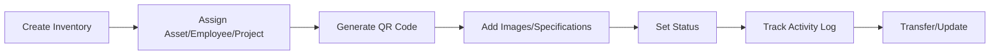
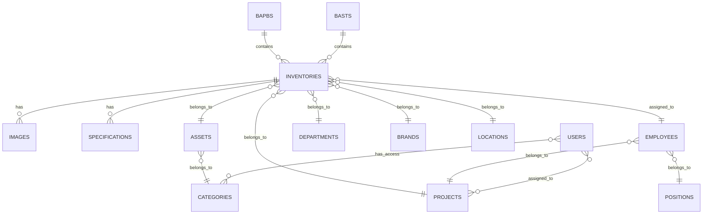
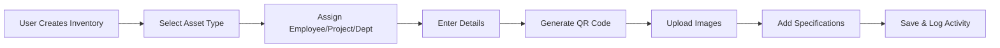
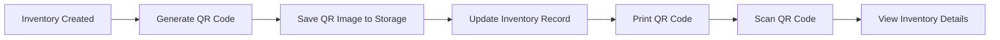
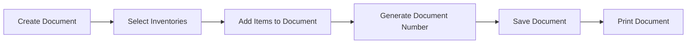

Purpose: Technical reference for understanding system design and development patterns
Last Updated: 2026-01-09

## Architecture Documentation Guidelines

### Document Purpose

This document describes the CURRENT WORKING STATE of the application architecture. It serves as:

-   Technical reference for understanding how the system currently works
-   Onboarding guide for new developers
-   Design pattern documentation for consistent development
-   Schema and data flow documentation reflecting actual implementation

### What TO Include

-   **Current Technology Stack**: Technologies actually in use
-   **Working Components**: Components that are implemented and functional
-   **File and Function Descriptions**: Short descriptions of ALL the files and functions in the codebase
-   **Actual Database Schema**: Tables, fields, and relationships as they exist
-   **Implemented Data Flows**: How data actually moves through the system
-   **Working API Endpoints**: Routes that are active and functional
-   **Deployment Patterns**: How the system is actually deployed
-   **Security Measures**: Security implementations that are active

### What NOT to Include

-   **Issues or Bugs**: These belong in `MEMORY.md` with technical debt entries
-   **Limitations or Problems**: Document what IS working, not what isn't
-   **Future Plans**: Enhancement ideas belong in `backlog.md`
-   **Deprecated Features**: Remove outdated information rather than marking as deprecated
-   **Wishlist Items**: Planned features that aren't implemented yet

### Update Guidelines

-   **Reflect Reality**: Always document the actual current state, not intended state
-   **Schema Notes**: When database schema has unused fields, note them factually
-   **Cross-Reference**: Link to other docs when appropriate, but don't duplicate content

### For AI Coding Agents

-   **Investigate Before Updating**: Use codebase search to verify current implementation
-   **Move Issues to Memory**: If you discover problems, document them in `MEMORY.md`
-   **Factual Documentation**: Describe what exists, not what should exist

---

# AR AIM v2 - Inventory Management System Architecture

## Project Overview

**AR AIM v2** (Asset & Inventory Management System) is a comprehensive inventory and asset tracking system built for ARKA company. It manages the complete lifecycle of company assets and inventory items, including asset registration, inventory tracking, QR code generation, goods receipt (BAPB), handover documents (BAST), and comprehensive reporting.

### Key Business Value

-   Centralized inventory and asset information management across multiple projects
-   QR code-based asset tracking and identification
-   Complete audit trail with activity logging
-   Goods receipt (BAPB) and handover (BAST) document management
-   Multi-project and multi-department inventory tracking
-   Employee-based asset assignment
-   Excel import/export for bulk operations
-   Real-time dashboard with inventory statistics

## Technology Stack

### Backend

-   **Framework**: Laravel 8.x (PHP 7.3+ / 8.0+)
-   **Database**: MySQL (via Laravel Eloquent ORM)
-   **Authentication**: Laravel Sanctum (API token authentication)
-   **Activity Logging**: Spatie Laravel Activity Log
-   **Excel Processing**: Maatwebsite Laravel Excel
-   **QR Code Generation**: Endroid QR Code
-   **DataTables**: Yajra Laravel DataTables Oracle
-   **Database Abstraction**: Doctrine DBAL
-   **Development Tools**: Clockwork (debugging), Laravel Tinker

### Frontend

-   **UI Framework**: Custom Bootstrap-based layout
-   **JavaScript**: jQuery, DataTables
-   **Charts**: Chart.js (for dashboard visualizations)
-   **QR Code**: Endroid QR Code library
-   **Asset Compilation**: Laravel Mix (Webpack)

### Infrastructure

-   **Local Development**: Laragon (Apache, MySQL, PHP)
-   **Server**: Apache Web Server
-   **Base URL**: `http://localhost/araim.v2` (development)
-   **Session Storage**: Database-backed sessions
-   **File Storage**: Local filesystem (storage/app)

### Key Dependencies

```json
{
    "laravel/framework": "^8.75",
    "laravel/sanctum": "^2.11",
    "spatie/laravel-activitylog": "^3",
    "maatwebsite/excel": "^3.1",
    "yajra/laravel-datatables-oracle": "~9.0",
    "endroid/qr-code": "^4.4",
    "itsgoingd/clockwork": "^5.1",
    "doctrine/dbal": "^3.3"
}
```

## Core Modules

### 1. Inventory Management

**Controllers**: `InventoryController`, `InventoryApiController`
**Models**: `Inventory`, `Image`, `Specification`

**Features**:

-   Complete inventory item management (create, read, update, delete)
-   Inventory status tracking (Good, Broken, etc.)
-   Transfer status management (Normal, Mutated, etc.)
-   QR code generation and printing for inventory items
-   Multiple image attachments per inventory item
-   Specification details management
-   Employee assignment to inventory items
-   Project and department assignment
-   Location and brand tracking
-   Excel import/export functionality
-   Inventory transfer between employees/locations
-   Public QR code JSON endpoint for scanning

**Key Routes**:

-   Web: `/inventories/*` - Full CRUD + transfer, QR code, images
-   API: `/api/inventories/qrcode_json/{id}` - Public QR code data

**Data Flow**:



### 2. Asset Management

**Controllers**: `AssetController`
**Models**: `Asset`, `Category`

**Features**:

-   Asset type master data management
-   Category-based asset classification
-   Asset-inventory relationship tracking
-   CRUD operations for asset types

**Key Routes**:

-   Web: `/assets/*` - Full CRUD (except show)

### 3. Employee Management

**Controllers**: `EmployeeController`
**Models**: `Employee`, `Position`, `Project`

**Features**:

-   Employee master data management
-   Project and position assignment
-   Employee-inventory relationship (who has what)
-   DataTables integration for listing
-   JSON API for dropdowns

**Key Routes**:

-   Web: `/employees/*` - Full CRUD
-   Web: `/employees/getEmployees` - DataTables data
-   Web: `/employees/json` - JSON API

### 4. Project Management

**Controllers**: `ProjectController`
**Models**: `Project`

**Features**:

-   Project master data management
-   Project-inventory relationship
-   Project-based inventory reporting

**Key Routes**:

-   Web: `/projects/*` - Full CRUD (except show)

### 5. Department Management

**Controllers**: `DepartmentController`
**Models**: `Department`

**Features**:

-   Department master data management
-   Department-inventory relationship
-   Department-based inventory reporting

**Key Routes**:

-   Web: `/departments/*` - Full CRUD (except show)

### 6. Location Management

**Controllers**: `LocationController`
**Models**: `Location`

**Features**:

-   Location master data management
-   Location-inventory relationship
-   Quick creation from inventory form

**Key Routes**:

-   Web: `/locations/*` - Full CRUD (except show)
-   Web: `/locations/storeFromInventory` - Quick create

### 7. Brand Management

**Controllers**: `BrandController`
**Models**: `Brand`

**Features**:

-   Brand master data management
-   Brand-inventory relationship
-   Quick creation from inventory form

**Key Routes**:

-   Web: `/brands/*` - Full CRUD (except show)
-   Web: `/brands/storeFromInventory` - Quick create

### 8. Category Management

**Controllers**: `CategoryController`
**Models**: `Category`, `User` (many-to-many relationship)

**Features**:

-   Category master data management
-   User-category relationship for access control
-   Category-based permission system

**Key Routes**:

-   Web: `/categories/*` - Full CRUD (except show)

### 9. Component Management

**Controllers**: `ComponentController`
**Models**: `Component`

**Features**:

-   Component master data management
-   Component specifications tracking

**Key Routes**:

-   Web: `/components/*` - Full CRUD (except show)
-   **Access**: Admin only

### 10. Position Management

**Controllers**: `PositionController`
**Models**: `Position`

**Features**:

-   Position/job title master data management
-   Position-employee relationship

**Key Routes**:

-   Web: `/positions/*` - Full CRUD (except show)

### 11. BAPB (Berita Acara Penerimaan Barang) - Goods Receipt

**Controllers**: `BapbController`
**Models**: `Bapb`

**Features**:

-   Goods receipt document creation
-   Multiple inventory items per BAPB
-   BAPB number generation
-   Print functionality
-   Item management (add/delete items)

**Key Routes**:

-   Web: `/bapbs/*` - Full CRUD + print
-   Web: `/bapbs/getInventories` - Get available inventories
-   Web: `/bapbs/delete_item/{id}` - Remove item from BAPB

### 12. BAST (Berita Acara Serah Terima) - Handover Document

**Controllers**: `BastController`
**Models**: `Bast`

**Features**:

-   Handover document creation
-   Multiple inventory items per BAST
-   BAST number generation
-   Print functionality
-   Item management (add/delete items)

**Key Routes**:

-   Web: `/basts/*` - Full CRUD + print
-   Web: `/basts/getInventories` - Get available inventories
-   Web: `/basts/delete_item/{id}` - Remove item from BAST

### 13. Dashboard & Analytics

**Controllers**: `DashboardController`
**Features**:

-   Total inventory statistics
-   Good vs Broken inventory counts
-   Asset summary by type
-   Project-based inventory distribution
-   Project-asset matrix
-   Employee count
-   Activity log viewing
-   Summary by project

**Key Routes**:

-   Web: `/dashboard` - Main dashboard
-   Web: `/dashboard/summary/{id}` - Project summary
-   Web: `/dashboard/logs` - Activity logs
-   Web: `/dashboard/json` - JSON data
-   Web: `/dashboard/getLogs` - Logs data

### 14. Tracking

**Controllers**: `TrackingController`
**Features**:

-   Inventory tracking functionality
-   Asset movement history

**Key Routes**:

-   Web: `/trackings` - Tracking interface

### 15. User & Permission Management

**Controllers**: `UserController`, `LoginController`, `RegisterController`
**Models**: `User`, `Category` (many-to-many)

**Features**:

-   User account management
-   Category-based access control
-   Role-based access (admin, superuser, user)
-   User-project association
-   User registration
-   Authentication and authorization

**Key Routes**:

-   Web: `/users/*` - User management (admin only)
-   Web: `/login`, `/logout` - Authentication
-   Web: `/register` - User registration

## Database Schema Overview

### Core Tables (28 migrations)

**User & Authentication**:

-   `users` - System users with role assignments and project associations
-   `personal_access_tokens` - Sanctum API tokens
-   `password_resets` - Password reset tokens
-   `failed_jobs` - Failed queue jobs

**Inventory Management**:

-   `inventories` - Inventory items master data
-   `images` - Inventory item images
-   `specifications` - Inventory specifications
-   `assets` - Asset type master data
-   `categories` - Category master data
-   `category_user` - User-category pivot table (access control)

**Master Data**:

-   `employees` - Employee master data
-   `projects` - Project master data
-   `departments` - Department master data
-   `positions` - Position/job title master data
-   `brands` - Brand master data
-   `locations` - Location master data
-   `components` - Component master data

**Documents**:

-   `bapbs` - Goods receipt documents (BAPB)
-   `basts` - Handover documents (BAST)

**Activity Logging**:

-   `activity_log` - Spatie activity log table

### Key Relationships



## API Architecture

### Authentication

-   **Method**: Laravel Sanctum token-based authentication
-   **Header**: `Authorization: Bearer {token}`
-   **Public Endpoints**: QR code JSON endpoint (no auth required)

### API Endpoints

**Inventory**:

-   `GET /api/inventories/qrcode_json/{id}` - Get QR code data (public)

**User**:

-   `GET /api/user` - Get authenticated user (requires Sanctum auth)

## Security Implementation

### Authentication & Authorization

-   **Session-based Auth**: For web interface (Laravel's default session driver)
-   **Token-based Auth**: Laravel Sanctum for API authentication
-   **Role-based Access**: Custom middleware `check_role` for admin, superuser, user roles
-   **Category-based Access**: User-category relationship for inventory access control
-   **Password Hashing**: Bcrypt hashing for user passwords
-   **Middleware Protection**: All authenticated routes protected with `auth` middleware

### CSRF Protection

-   CSRF token validation on all POST/PUT/DELETE/PATCH requests
-   Automatic token generation in Blade templates via `@csrf` directive

### Input Validation

-   Controller-level validation
-   Database-level constraints (foreign keys, unique constraints)
-   XSS protection via Laravel's automatic escaping in Blade templates

### File Upload Security

-   File type validation (image uploads)
-   File size limits
-   Storage in protected directories (storage/app)
-   Controlled file access via download routes with authentication check

### API Security

-   Token expiration (Sanctum tokens)
-   Public QR code endpoint for scanning (read-only)

### Database Security

-   Parameterized queries via Eloquent ORM (SQL injection protection)
-   Database credentials in environment variables
-   Foreign key constraints for referential integrity

## Deployment Architecture

### Development Environment

-   **Server**: Laragon (Windows) - Apache + MySQL + PHP
-   **Web Root**: `C:\laragon\www\araim.v2`
-   **URL**: `http://localhost/araim.v2`
-   **PHP Version**: 7.3+ / 8.0+
-   **MySQL**: Latest version via Laragon
-   **Node.js**: For asset compilation (Laravel Mix)

### Application Structure

```
araim.v2/
├── app/
│   ├── Exports/                  # Excel export classes
│   ├── Http/
│   │   ├── Controllers/          # 19 controllers
│   │   ├── Middleware/           # Custom middleware
│   │   └── Api/                  # API controllers
│   ├── Imports/                  # Excel import classes
│   ├── Models/                   # 15 Eloquent models
│   └── Providers/                # Service providers
├── bootstrap/                    # Bootstrap files
├── config/                       # Configuration files
├── database/
│   ├── migrations/               # 28 migration files
│   ├── seeders/                  # Database seeders
│   └── factories/                # Model factories
├── docs/                         # Documentation
│   ├── architecture.md           # This file
│   ├── todo.md                   # Task tracking
│   ├── backlog.md                # Feature backlog
│   └── decisions.md              # Technical decisions
├── public/                       # Web root
│   ├── assets/                   # Compiled assets
│   ├── images/                   # Public images
│   └── index.php                 # Entry point
├── resources/
│   ├── css/                      # Custom CSS
│   ├── js/                       # Custom JavaScript
│   └── views/                    # Blade templates
├── routes/
│   ├── web.php                   # Web routes
│   ├── api.php                   # API routes
│   ├── console.php               # Console routes
│   └── channels.php              # Broadcast channels
├── storage/                       # File storage
│   ├── app/                      # Application files
│   ├── framework/                # Framework cache
│   └── logs/                     # Application logs
├── tests/                        # PHPUnit tests
└── vendor/                       # Composer dependencies
```

### Configuration Files

-   `.env` - Environment configuration (not in repository)
-   `.env.example` - Environment template
-   `config/app.php` - Application configuration
-   `config/database.php` - Database configuration
-   `config/sanctum.php` - API authentication configuration
-   `config/activitylog.php` - Activity logging configuration
-   `config/excel.php` - Excel import/export configuration

### Asset Compilation

-   **Laravel Mix**: Asset bundler (Webpack wrapper)
-   **CSS**: Compiled from `resources/css/app.css`
-   **JavaScript**: Compiled from `resources/js/app.js`
-   **Build Command**: `npm run production`
-   **Dev Command**: `npm run dev`

### File Storage

-   **Driver**: Local filesystem
-   **Storage Path**: `storage/app`
-   **Subdirectories**:
    -   `storage/app/qrcode/` - Generated QR codes
    -   `storage/app/images/` - Uploaded images

### Logging

-   **Driver**: Daily log files
-   **Location**: `storage/logs/laravel-{date}.log`
-   **Activity Log**: Spatie Activity Log package
-   **Log Level**: Configurable via `.env` (default: debug in development)
-   **Clockwork**: Development debugging tool (accessible at `/clockwork`)

### Database Migrations

-   **Total Migrations**: 28 files
-   **Migration Command**: `php artisan migrate`
-   **Seeding Command**: `php artisan db:seed`
-   **Fresh Install**: `php artisan migrate:fresh --seed`

## Data Flow Patterns

### Inventory Creation Flow



### QR Code Generation Flow



### BAPB/BAST Document Flow



## Helper Functions & Utilities

### Global Helper Functions

-   Custom helper functions may exist in `app/Helpers/` (if created)

### Traits

-   Custom traits in `app/Traits/` for code reusability (if created)

### Services

-   Business logic abstraction in `app/Services/` (if created)

## Frontend Architecture

### View Layer

-   **Template Engine**: Blade (Laravel's templating engine)
-   **Layout Pattern**: Master layout with section inheritance
-   **Main Layout**: `resources/views/layouts/main.blade.php`

### JavaScript Architecture

-   **Core Library**: jQuery
-   **DataTables**: Server-side processing for large datasets
-   **AJAX**: For dynamic content loading and form submissions
-   **Chart.js**: Dashboard visualizations
-   **Custom Scripts**: Module-specific JavaScript in view files

### CSS Architecture

-   **Framework**: Bootstrap (custom implementation)
-   **Icons**: Font Awesome (if used)
-   **Custom Styles**: `resources/css/app.css`

### Form Handling

-   **Validation**: Client-side (HTML5 + jQuery) and server-side (Laravel)
-   **CSRF Protection**: Automatic token inclusion via `@csrf` directive
-   **Method Spoofing**: `@method('PUT')` for RESTful routes
-   **File Uploads**: `enctype="multipart/form-data"` with client-side preview

### Component Organization

```
resources/views/
├── layouts/
│   ├── main.blade.php            # Main layout
│   └── partials/                 # Reusable partials
├── dashboard/                    # Dashboard views
├── inventories/                  # Inventory management views
├── assets/                       # Asset management views
├── employees/                    # Employee management views
├── projects/                     # Project management views
├── departments/                  # Department management views
├── locations/                    # Location management views
├── brands/                       # Brand management views
├── categories/                   # Category management views
├── components/                   # Component management views
├── positions/                    # Position management views
├── bapbs/                        # BAPB document views
├── basts/                        # BAST document views
├── trackings/                    # Tracking views
├── users/                        # User management views
├── login.blade.php               # Login page
└── register.blade.php           # Registration page
```

## Performance Considerations

### Database Optimization

-   **Indexing**: Foreign keys indexed by migrations
-   **Eager Loading**: Using `with()` to prevent N+1 queries
-   **Pagination**: DataTables server-side processing for large datasets
-   **Query Optimization**: Select only needed columns

### Caching Strategy

-   **Config Cache**: `php artisan config:cache` for production
-   **Route Cache**: `php artisan route:cache` for production
-   **View Cache**: Blade templates compiled and cached

### Asset Optimization

-   **Minification**: CSS and JS minified in production build
-   **Browser Caching**: HTTP headers for static assets

## Testing Infrastructure

### Test Structure

-   **Framework**: PHPUnit 9.x
-   **Test Types**: Feature tests and Unit tests
-   **Test Location**: `tests/` directory
-   **Test Command**: `php artisan test`

### Current Test Coverage

-   Minimal test coverage
-   Opportunity for improvement in test coverage

## Known Patterns & Conventions

### Naming Conventions

-   **Controllers**: Singular resource name + `Controller` suffix
-   **Models**: Singular, CamelCase
-   **Database Tables**: Plural, snake_case
-   **Routes**: RESTful naming (index, create, store, show, edit, update, destroy)
-   **Views**: Folder structure mirrors controller structure

### Code Style

-   **PSR-12**: PHP coding standard
-   **Laravel Conventions**: Following Laravel best practices
-   **Blade Syntax**: Clean template syntax with minimal logic

### Error Handling

-   **Try-Catch**: Used in controllers for database operations
-   **Form Validation**: Controller-level validation with custom error messages
-   **Log Errors**: Critical errors logged to `storage/logs/`

### Common Patterns

-   **Repository Pattern**: Not strictly implemented, using Eloquent directly
-   **Service Pattern**: Business logic in controllers (can be refactored to services)
-   **Observer Pattern**: Activity logging via Spatie Activity Log

## Integration Points

### External Systems

-   **No External APIs**: Currently self-contained system

### Internal Integrations

-   **Inventory ↔ Employee**: Employee assignment to inventory items
-   **Inventory ↔ Project**: Project-based inventory tracking
-   **Inventory ↔ Department**: Department-based inventory tracking
-   **BAPB/BAST ↔ Inventory**: Document-inventory relationship
-   **User ↔ Category**: Category-based access control
-   **User ↔ Project**: Project-based user access

## Monitoring & Debugging

### Development Tools

-   **Clockwork**: Performance profiling and debugging (`/clockwork`)
-   **Laravel Tinker**: Interactive REPL for testing
-   **Activity Log**: Spatie Activity Log for audit trail

### Error Tracking

-   **Log Files**: Daily log rotation in `storage/logs/`
-   **Error Pages**: Custom error pages for 403, etc.
-   **Debug Mode**: Configurable via `.env` (APP_DEBUG)

### Performance Monitoring

-   **Query Logging**: Enabled in development via Clockwork
-   **Execution Time**: Tracked in Clockwork
-   **Memory Usage**: Monitored in Clockwork

---

## Quick Reference

### Key File Locations

-   **Routes**: `routes/web.php`, `routes/api.php`
-   **Controllers**: `app/Http/Controllers/`
-   **Models**: `app/Models/`
-   **Views**: `resources/views/`
-   **Migrations**: `database/migrations/`
-   **Seeders**: `database/seeders/`
-   **Config**: `config/`
-   **Documentation**: `docs/`

### Common Artisan Commands

```bash
# Database
php artisan migrate
php artisan migrate:fresh --seed
php artisan db:seed

# Cache
php artisan config:cache
php artisan route:cache
php artisan view:clear
php artisan cache:clear

# Development
php artisan serve
php artisan tinker
php artisan make:controller ControllerName
php artisan make:model ModelName -m
php artisan make:migration create_table_name

# Testing
php artisan test
```

### Environment Variables

```env
APP_NAME="AR AIM v2"
APP_URL=http://localhost/araim.v2
DB_CONNECTION=mysql
DB_HOST=127.0.0.1
DB_PORT=3306
DB_DATABASE=araim_v2
DB_USERNAME=root
DB_PASSWORD=
```

---

**Last Updated**: 2026-01-09 by AI Agent
**Next Review**: When major architectural changes are implemented
